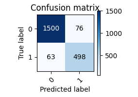

# Epoch losses
|                |         |
|----------------|---------|
| Epoch 1 loss   | 0.268   |
| Epoch 2 loss   | 0.215   |
| Epoch 3 loss   | 0.207   |

# Metrics
|                |         |
|----------------|---------|
| Validation accuracy   | 92.743%   |
| Test accuracy   | 93.496%   |
| F1 Score   | 0.878   |
| Precision   | 0.868   |
| Recall   | 0.888   |

# Confusion Matrix

# Other info
|                |         |
|----------------|---------|
| Criterion   | Cross Entropy Loss   |
| Optimizer   | Adam   |
| Learning Rate   | 0.001   |
| Batch Size   | 32   |
